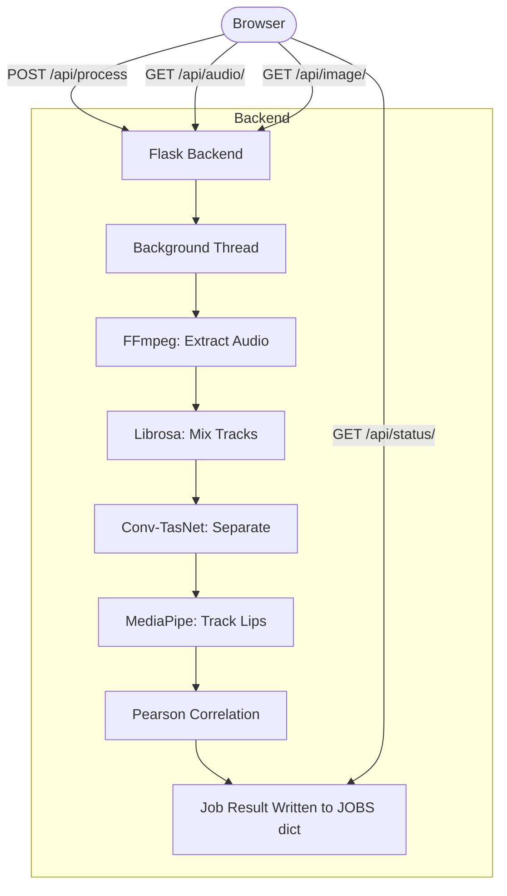

<div align="center">

<h1>Audio-Visual Voice Isolation</h1>

<p>
    <strong>Solving the Cocktail Party Problem with Neural Source Separation</strong>
</p>

<p>
    A multimodal voice isolation pipeline that mixes two speaker videos,
    separates them using a neural network, and identifies the target voice
    by correlating audio energy against lip movement.
    <br />
    <em>Built with Flask, Conv-TasNet (Asteroid), and MediaPipe.</em>
</p>

<p align="center">
    
    
    
    
    
</p>

</div>

---

## Project Objective

The **cocktail party problem** — isolating a single voice from an overlapping multi-speaker mix — is one of the harder problems in audio engineering. This project solves it by combining two approaches:

- **Audio-side**: A pre-trained [Conv-TasNet](https://arxiv.org/abs/1809.07454) model (trained on LibriMix) does the actual source separation on a blended audio mix.
- **Visual-side**: [MediaPipe Face Landmarker](https://developers.google.com/mediapipe/solutions/vision/face_landmarker) extracts lip movement data from the target speaker's video.

Both signals are then compared using Pearson correlation. The separated audio track whose energy rhythm most closely matches the target speaker's lip movement is selected as the isolated voice.

---

## How the Pipeline Works

```
[Video 1 — Target Speaker]  ─────────────┐
                                          ├──→  [Mix Audio]  ──→  [Conv-TasNet Separate]  ──→  [Track A]
[Video 2 — Other Speaker]   ─────────────┘                                                ──→  [Track B]
                                                                                                    │
[Video 1 — Lip Tracking (MediaPipe)]  ──→  [Lip Movement Signal]  ──────────────────────── [Correlate]
                                                                                                    │
                                                                                    [Highest r = Winner]
```

1. **Extract**: FFmpeg strips the audio from both videos and resamples to 16kHz mono.
2. **Mix**: Librosa blends the two audio signals into a single overlapping track.
3. **Separate**: Conv-TasNet splits the noisy mix back into two clean isolated tracks.
4. **Track Lips**: MediaPipe measures the Euclidean distance between the upper and lower lip landmarks on every frame of the target video.
5. **Match**: Pearson correlation (`r`) is computed between the RMS energy envelope of each separated track and the lip movement signal. Highest `r` wins.

---

## API Overview

The Flask backend exposes a minimal REST API. The frontend polls `/api/status/<job_id>` during processing to get live step updates and logs.

| Method | Endpoint | Description |
| :--- | :--- | :--- |
| `POST` | `/api/process` | Upload two video files, kicks off the pipeline. Returns `job_id`. |
| `GET` | `/api/status/<job_id>` | Returns current step, progress %, logs, and final result on completion. |
| `GET` | `/api/audio/<filename>` | Streams a separated audio `.wav` file for playback. |
| `GET` | `/api/image/<filename>` | Serves a generated graph (lip movement, energy plots). |
| `GET` | `/api/health` | Returns `ok` and the active separation backend (`conv_tasnet` or `spectral`). |

---

## Architecture



> The pipeline runs in a daemon thread per job. Job state is stored in an in-memory Python dict (`JOBS`) and polled by the frontend every second.

---

## Project Structure

```text
image-voice-isolation/
│
├── app.py                      # Flask routes and job dispatch
├── pipeline.py                 # Core audio pipeline (extract, mix, separate, correlate)
├── lip_tracker.py              # MediaPipe face landmark extraction
├── models.py                   # Lazy model loader (Conv-TasNet via Asteroid/HuggingFace)
│
├── frontend/
│   ├── index.html              # Single-page app shell
│   ├── style.css               # Editorial dark-theme UI
│   └── app.js                  # Pipeline polling, WaveSurfer.js waveforms, results rendering
│
├── face_landmarker.task        # MediaPipe model bundle (auto-downloaded on first run)
├── raw_videos/                 # Sample test videos (not committed)
├── uploads/                    # Temp upload storage (auto-cleaned after 1h)
├── outputs/                    # Separated audio + graphs (auto-cleaned after 1h)
├── pretrained_models/          # HuggingFace model cache
│
├── requirements.txt
├── .env.example                # Config template
└── .gitignore
```

---

## Local Setup Guide

### Prerequisites

- Python 3.10+
- `ffmpeg` installed and on `PATH` (or set `FFMPEG_PATH` in `.env`)
- A HuggingFace account with a read token (for downloading Conv-TasNet weights)

To install ffmpeg on Windows:
```bash
winget install Gyan.FFmpeg
```

### 1. Clone & Set Up Environment
```bash
git clone <repo-url>
cd image-voice-isolation

python -m venv venv

# Windows
venv\Scripts\activate
# Mac / Linux
source venv/bin/activate
```

### 2. Install Dependencies
```bash
pip install -r requirements.txt
```
> First install will download PyTorch. This can take a few minutes depending on connection speed.

### 3. Configure Environment
```bash
cp .env.example .env
```
Open `.env` and set your HuggingFace token:
```env
HF_TOKEN=hf_your_token_here
```
The model downloaded is `JorisCos/ConvTasNet_Libri2Mix_sepclean_16k` (~50MB). If the download fails, the system automatically falls back to a spectral masking separator.

### 4. Run the Server
```bash
python app.py
```
Open `http://localhost:5000` in your browser.

---

## Configuration Reference

All settings are controlled via `.env`. No code changes required.

| Variable | Default | Description |
| :--- | :--- | :--- |
| `HF_TOKEN` | *(required)* | HuggingFace read token for model download. |
| `PORT` | `5000` | Port the Flask server binds to. |
| `MAX_FILE_MB` | `100` | Per-file upload size limit in MB. |
| `MAX_CLIP_SECONDS` | `10` | Videos are trimmed to this length before processing. |
| `CLEANUP_INTERVAL_SECONDS` | `1800` | How often the cleanup thread runs to delete old outputs (seconds). |
| `SEP_MODEL_REPO` | `JorisCos/ConvTasNet_Libri2Mix_sepclean_16k` | HuggingFace model repo for separator. |
| `LIP_SMOOTH_WINDOW` | `5` | Frame window for smoothing the raw lip distance signal. |
| `FFMPEG_PATH` | *(empty = system PATH)* | Absolute path to ffmpeg binary, if not on PATH. |

---

## Known Limitations

Being upfront about what this system does and doesn't do well:

- **Correlation is a weak signal on heavy overlap**: When both speakers are talking at the same time with similar rhythms, Pearson correlation on lip-vs-audio-energy can misidentify the target voice. A deep audio-visual fusion model (e.g. AV-HuBERT) would be the proper fix.
- **In-memory job state**: All job history is wiped on server restart. There's no database. If the server crashes mid-job, the job is lost.
- **Lip tracking requires a visible face**: Side profiles, extreme head movements, low resolution video, or heavy occlusion will cause MediaPipe to drop frames. When too many frames are lost, the system falls back to pure energy comparison with no visual anchor.
- **10-second clip cap**: Processing is capped at `MAX_CLIP_SECONDS` (default 10s) to keep CPU time reasonable on a development machine. Longer clips require a proper GPU setup.
- **No concurrency**: Flask's development server handles one request at a time. Multiple simultaneous users will queue. Production would need Gunicorn + Celery workers.
- **Windows ffmpeg paths**: The default `winget` install puts ffmpeg in a long path under `AppData`. If extraction fails, set `FFMPEG_PATH` explicitly in `.env`.

> These are intentional trade-offs for a research prototype — not production hardening failures.

---

**© 2026 Audio-Visual Voice Isolation**
